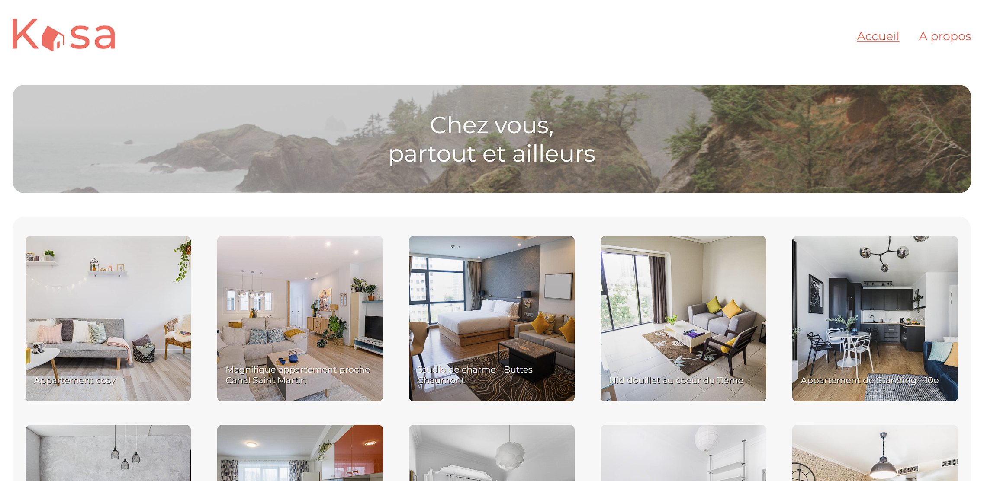

# Kasa - Use React to create a web app

Project 7 of OpenClassroom's

## Available Scripts

In the project directory, you can run:

### `npm start`

Runs the app in the development mode.
Open [http://localhost:3000](http://localhost:3000) to view it in your browser.

## Technologies used

* NodeJS
* React
* SCSS
